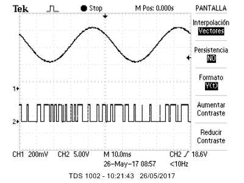

# DS-Modulator

This was done as part of a university project aimed at building an analog first order delta-sigma modulator, to use in a larger audio amplification system.

As it became more and more clear that the components we were using and the laboratory equipment in which we were testing the system were not going to give good results, I decided to try and implement the modulator as a digital system, using a microcontroller.

The main reason for investigating a digital system comes from the fact that it has virtually no noise, and therefore a very precise modulated signal could theoretically be obtained, leading to high quality output. As we had limited resources, I decided to use a simple platform for the first prototype, and an Arduino Uno board was selected for the task.

One of the main advantages of a digital system was that it could solve the equations of the Delta-Sigma modulator system directly, using the capabilities of the microprocessor. Thus, the main thing needed to implement the system were a set of difference equations, which were found in the book *Understanding Delta-Sigma Data Converters*, by Schreier and Temes, pages 74 and 64.

Before programming the microcontroller two MATLAB functions were written, one for a second order modulator and the other for a fifth order version. The objective was to test the performance of the equations before programming them. After some deliberation, I decided to focus on the second order version. The results of these simulations are included in the MATLAB folder.

Once it was verified that the equations did in fact work, and after having determined a good working frequency value, I began working on the implementation.

The first thing was to try to solve the equations in real time, and to use the default Arduino libraries for Input/Output, but the performance was quickly observed to be very poor. After a lot of time debugging, the problem was found to be the speed of the ADC in the microprocessor of the Arduino, which could not sample the signal with meaningful values because it was too slow. Even trying with low frequency signals of 10 Hz and 1 Hz, it could not sample fast enough.

Therefore, I decided to investigate the internal workings of the 8-bit AVR ATmega328 processor of the Arduino to try and optimize the speed in hopes of getting a working version, even if it was at low input frequencies only. This is the version in the Arduino folder.

Testing this version of the modulator showed results using signals with frequencies up to 20 Hz, still too low to be of any use in the full amplifier. Even using these frequencies, the results were not good; the microprocessor was still too slow. The results are shown in the following images.

Using a 10 Hz input signal:

Using a 20 Hz input signal:

And finally, using a 1 kHz input signal:

Therefore, it was decided that the Arduino was not an adequate platform to implement a real-time audio processing system like this one, and a more powerful platform would be needed for the task.

After some more research, the STM32F4 family of boards was determined to be a good candidate to implement the modulator, as they include a high speed ARM Cortex CPU, which goes up to 168 MHz and has a 12 bit fast ADC. The price of these boards is reasonably low.

Due to time restrictions, I was not able to try the final version programmed for the STM32F4 board, but I have uploaded it here anyway, as it would be more likely to work than the AVR version, given the speed of the ARM CPU.
